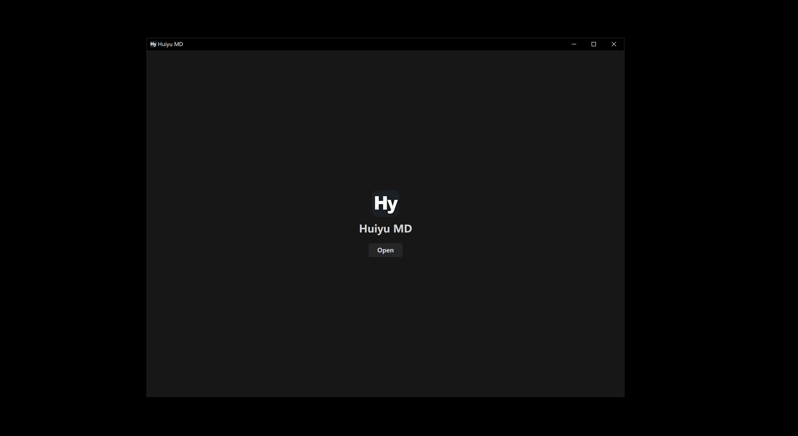
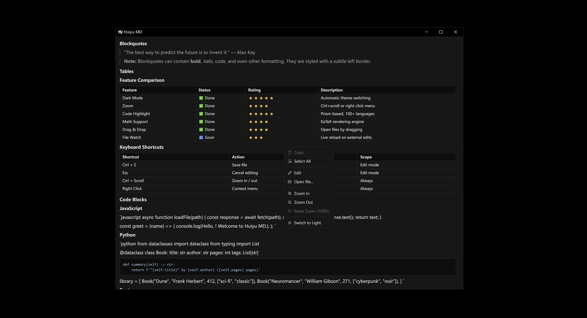
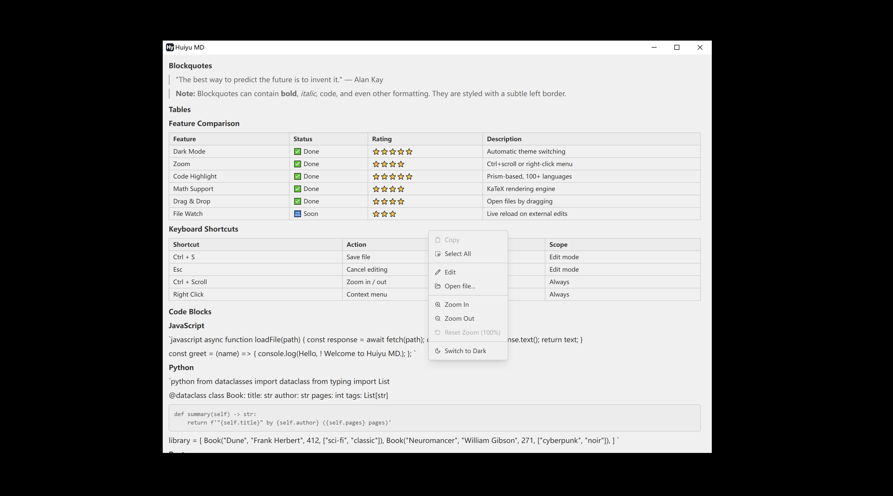

# ✨ Huiyu MD

<p align="center">
  <b>A minimal, lightning-fast Markdown reader for Windows & macOS.</b><br>
  <sub>Built with Tauri 2.0 · Zero bloat · Instant startup · Dark & Light themes</sub>
</p>

<p align="center">
  
  
  
  
  
</p>

<p align="center">
  
</p>

<table align="center">
  <tr>
    <td align="center"></td>
    <td align="center"></td>
  </tr>
  <tr>
    <td align="center"><sub><b>🌙 Dark Mode</b></sub></td>
    <td align="center"><sub><b>☀️ Light Mode</b></sub></td>
  </tr>
</table>

---

## 🚀 Why Huiyu MD?

> **No clutter. No lag. Just your Markdown.**

| | Huiyu MD | Typical Editors |
|---|:---:|:---:|
| ⚡ Startup time | **< 0.3s** | 2–5s |
| 📦 App size | **~5 MB** | 80–200 MB |
| 🧠 RAM usage | **~30 MB** | 200–500 MB |
| 🎨 Theme | Dark + Light | Often paid |
| 🔍 Zoom | ✅ Ctrl+scroll | Varies |
| 📐 Math formulas | ✅ KaTeX | Rare |
| 💻 Code highlighting | ✅ 100+ langs | Varies |
| 🖱️ Drag & drop | ✅ | Rare |
| 📁 File association | ✅ Auto | Manual |
| 🪟 Win + Mac | ✅ Both | Rare |

---

## ✨ Features

<table>
  <tr>
    <td width="50%">

### ⚡ Blazing Fast

- **Zero white flash** — window hidden until content renders
- **Lazy-loaded** — only 213 kB initial bundle
- **Single IPC call** — reads file + path in one shot

    </td>
    <td width="50%">

### 🎨 Beautiful Rendering

- **KaTeX math** — inline `$...$` and block `$$...$$`
- **Code blocks** — syntax highlighting + copy button
- **Tables, lists, blockquotes** — full GFM support

    </td>
  </tr>
  <tr>
    <td>

### 🔧 Smart Editing

- **CodeMirror 6** — full editor with undo/redo
- **Syntax highlighting** for Markdown
- **Ctrl+S** to save, **Esc** to cancel

    </td>
    <td>

### 🎯 Thoughtful Details

- **Ctrl+scroll zoom** — 25% to 400%
- **Right-click menu** — copy, edit, zoom, theme
- **Drag & drop** — open any file instantly
- **Single instance** — no duplicate windows

    </td>
  </tr>
</table>

---

## 📥 Download

<div align="center">

### **👉 [Download Latest Release](https://github.com/huiyu9144/Huiyu-MD/releases) 👈**

</div>

| Platform | Installer | Notes |
|----------|-----------|-------|
| 🪟 **Windows** | [`Huiyu.MD_1.4.0_x64-setup.exe`](https://github.com/huiyu9144/Huiyu-MD/releases) | NSIS — auto file association |
| 🪟 **Windows** | [`Huiyu.MD_1.4.0_x64_en-US.msi`](https://github.com/huiyu9144/Huiyu-MD/releases) | MSI — enterprise deployment |
| 🍎 **macOS (Universal)** | [`Huiyu.MD_1.4.0_universal.dmg`](https://github.com/huiyu9144/Huiyu-MD/releases) | Intel + Apple Silicon |
| 🍎 **macOS (Intel)** | [`Huiyu.MD_1.4.0_x64.dmg`](https://github.com/huiyu9144/Huiyu-MD/releases) | For Intel Macs |
| 🍎 **macOS (Apple Silicon)** | [`Huiyu.MD_1.4.0_aarch64.dmg`](https://github.com/huiyu9144/Huiyu-MD/releases) | For M1/M2/M3/M4 |

---

## 🛠️ Install

### Windows
Run the installer → done. It automatically:
- Registers `.md` / `.txt` as default handler
- Adds "Open with Huiyu MD" to right-click menu

### macOS
Mount the `.dmg` → drag **Huiyu MD** to **Applications** → done.

> Requires macOS 10.15 (Catalina) or later.

---

## 🧑‍💻 Development

### Prerequisites

| Tool | Version |
|------|---------|
| [Node.js](https://nodejs.org/) | 20+ |
| [Rust](https://rustup.rs/) | 1.77+ |
| [Tauri system deps](https://v2.tauri.app/start/prerequisites/) | — |

### Quick Start

```bash
git clone https://github.com/huiyu9144/Huiyu-MD.git
cd Huiyu-MD
npm install
npm run tauri dev
```

### Build

```bash
# Standard build
npm run tauri build

# macOS universal binary (Intel + Apple Silicon)
npm run tauri build -- --target universal-apple-darwin --bundles dmg
```

---

## 📁 Project Structure

```
Huiyu MD/
├── src/
│   ├── App.tsx              ← Main component + orchestration
│   ├── MarkdownRenderer.tsx ← Markdown → HTML (KaTeX + GFM)
│   ├── MarkdownEditor.tsx   ← CodeMirror 6 editor
│   ├── index.css            ← Theme variables
│   └── main.tsx             ← React entry
└── src-tauri/
    ├── src/lib.rs           ← Tauri commands
    ├── installer_hooks.nsh  ← Windows file association
    ├── capabilities/        ← Permission scopes
    └── tauri.conf.json      ← App configuration
```

---

## ⚡ Performance

| What | How |
|------|-----|
| No white flash | `visible: false` → `show()` after render |
| Tiny bundle | `React.lazy` + code splitting → 213 kB |
| Fast file reads | Rust `std::fs::read_to_string` |
| Single IPC call | Path + content in one `invoke` |
| Cached modules | `invoke`, `getCurrentWindow` cached |

---

## 📄 License

[MIT](LICENSE) — feel free to use, modify, and distribute.

---

<p align="center">
  <sub>Built with ❤️ using <b>Tauri</b>, <b>React</b>, and <b>Vite</b></sub><br>
  <sub>⭐ Star this repo if you find it useful!</sub>
</p>